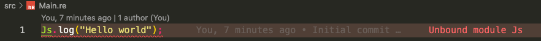

# melange-basic-template

A simple project template using [Melange](https://github.com/melange-re/melange).

## Getting started

You will need [esy](https://esy.sh) package manager to obtain OCaml and Melange sources. See `esy` installation instructions [here](https://esy.sh/docs/en/getting-started.html#install-esy).

Once `esy` is available, run

```bash
esy
```

to install all dependencies.

Then:

```bash
esy build
```

to build the project. This command, as constructed in `esy.json`,

1. generates a symbolically linked dir `bs-platform` in `node_modules`, which is helpful when using JavaScript bundlers like Webpack that expect to find Melange stdlib JavaScript files under `node_modules/bs-platform`.
2. builds the project.

Now you should see a `_build` folder with all generated files, you can run

```bash
esy x node _build/default/src/Main.bs.js
```

to see the result of the script running.

## Editor support in VSCode

Using these dependencies
```json
  "dependencies": {
    "ocaml": "4.14.0",
    "@opam/reason": "3.8.0",
    "@opam/dot-merlin-reader": "4.2",
    "melange": "melange-re/melange",
    "@opam/cmdliner": "1.1.0",
    "@opam/ocaml-lsp-server": "ocaml/ocaml-lsp:ocaml-lsp-server.opam#196ad28"
  },
```

Select `esy(melange-editor-support)` as your sandbox.

You still get errors in the your file. If you use `opam(4.14.0)` directly as sandbox you dont get errors.



## Solution per [@zecklar](https://discord.com/channels/235176658175262720/825155604641218580/981161512905371688)

```sh
1. Install OCaml plugin https://marketplace.visualstudio.com/items?itemName=ocamllabs.ocaml-platform
2. Build your project esy build
3. Launch VSCode in your esy dev environment `esy code .`
4. On the lefthand side, click OCaml extension icon
5. Click "Select sandbox"
6. Select "Custom" from the dropdown
7. Pass the flag, the input box should contain $prog $args --fallback-read-dot-merlin
8. Voila, at least typehints/navigation etc seem to work
```